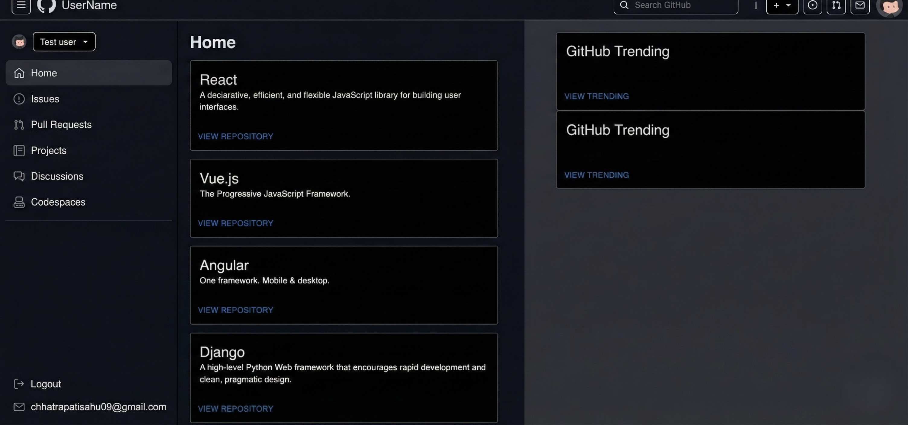
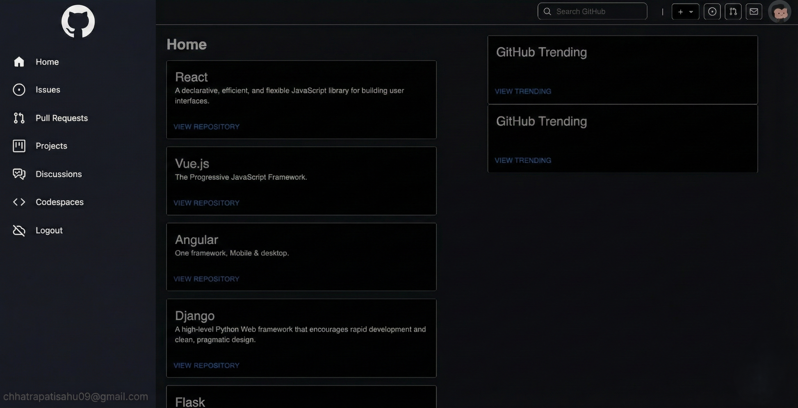

# GitHub Clone

<div align="center">
	
	<h1>GitHub Clone</h1>
	<p>A full-stack GitHub-like platform built with the MERN stack and custom version control.</p>
	<br/>
	<a href="https://github.com/Chhatrapati-sahu-09/github-clone-/actions">
		
	</a>
	<a href="https://github.com/Chhatrapati-sahu-09/github-clone-/blob/main/LICENSE">
		
	</a>
	<a href="https://github.com/Chhatrapati-sahu-09/github-clone-/stargazers">
		
	</a>
	<a href="https://github.com/Chhatrapati-sahu-09/github-clone-/network/members">
		
	</a>
</div>

---

## 🚀 About the Project

GitHub Clone is a full-stack web application inspired by GitHub. It allows users to create repositories, manage issues, view profiles, and more. It also features a custom version control system, real-time updates, and a modern UI.

## 🖼️ Demo & Screenshots

<div align="center">
	
	<br/>
	
</div>

---

## ✨ Features

- User authentication & profile management
- Create, view, and manage repositories
- Custom version control: init, add, commit, push, pull, revert
- Issue tracking system
- Pull requests & commit history
- Dashboard with suggested repositories
- Heatmap for user activity
- Real-time updates with Socket.io
- Responsive UI with modern design

---

## 🛠️ Tech Stack

- **Frontend:** React, Vite, Primer React, Axios
- **Backend:** Node.js, Express, Socket.io
- **Database:** MongoDB
- **Other:** AWS (for file storage), UIW HeatMap

---

## 📁 Folder Structure

```
Github/
	backend-main/
		controllers/
		middleware/
		models/
		routes/
		index.js
		package.json
	frontend-main/
		public/
		src/
			components/
			assets/
			App.jsx
			main.jsx
			Routes.jsx
		package.json
	screenshot/
	README.md
```

---

## 📦 Installation

```bash
# Clone the repository
git clone https://github.com/Chhatrapati-sahu-09/github-clone-.git

# Install backend dependencies
cd Github/backend-main
npm install

# Install frontend dependencies
cd ../frontend-main
npm install
```

---

## 🏃‍♂️ Running the App

```bash
# Start backend server
cd Github/backend-main
npm start

# Start frontend server
cd ../frontend-main
npm run dev
```

- Frontend: [http://localhost:5173](http://localhost:5173) or [http://localhost:5174](http://localhost:5174)
- Backend: [http://localhost:3002](http://localhost:3002)

---

## 🔗 Main Frontend Pages

- [Dashboard](/)
- [Profile](/profile)
- [Init Repo](/repo/init)
- [Add File](/repo/add)
- [Commit](/repo/commit)
- [Push](/repo/push)
- [Pull](/repo/pull)
- [Revert](/repo/revert)

---

## 📚 API Endpoints (Backend)

- `POST /api/auth/login` — User login
- `POST /api/auth/signup` — User signup
- `GET /api/userProfile/:id` — Get user profile
- `GET /repo/user/:id` — Get user repositories
- `POST /repo/init` — Initialize repository
- `POST /repo/add` — Add file to repository
- `POST /repo/commit` — Commit changes
- `POST /repo/push` — Push to remote (S3)
- `POST /repo/pull` — Pull from remote (S3)
- `POST /repo/revert` — Revert to commit

---

## 📚 Usage

- Sign up and log in
- Create repositories
- Star and fork repositories
- Create and manage issues
- View user profiles and activity heatmap
- Use custom version control commands (init, add, commit, push, pull, revert)

---

## 🤝 Contributing

Contributions are welcome! Please open issues and submit pull requests for improvements.

---

## ❓ FAQ

**Q: How is version control implemented?**  
A: The backend implements custom logic for repository commands (init, add, commit, push, pull, revert) and stores data in MongoDB and AWS S3.

**Q: Can I use this for real projects?**  
A: This is a learning/demo project. For production, use official GitHub or GitLab.

**Q: How do I report bugs or request features?**  
A: Please open an issue on the [GitHub Issues page](https://github.com/Chhatrapati-sahu-09/github-clone-/issues).

---

## 📄 License

This project is licensed under the MIT License.

---

<div align="center">
	<strong>Made with ❤️ by Chhatrapati Sahu</strong>
</div>
# Github
A MERN based Github replica with custom version control implemented from scratch.
<div align="center">
	
	<h1>GitHub Clone</h1>
	<p>A full-stack GitHub-like platform built with MERN stack</p>
	<br/>
	<a href="https://github.com/Chhatrapati-sahu-09/github-clone-/actions">
		
	</a>
	<a href="https://github.com/Chhatrapati-sahu-09/github-clone-/blob/main/LICENSE">
		
	</a>
	<a href="https://github.com/Chhatrapati-sahu-09/github-clone-/stargazers">
		
	</a>
	<a href="https://github.com/Chhatrapati-sahu-09/github-clone-/network/members">
		
	</a>
</div>

---

## 🚀 About the Project

GitHub Clone is a full-stack web application inspired by GitHub. It allows users to create repositories, manage issues, view profiles, and more. Built using React, Node.js, Express, and MongoDB.

## 🖼️ Features
- User authentication & profile management
- Create, view, and manage repositories
- Issue tracking system
- Pull requests & commits
- Dashboard with suggested repositories
- Heatmap for user activity
- Responsive UI with modern design

## 🛠️ Tech Stack
- **Frontend:** React, Vite, Primer React, Axios
- **Backend:** Node.js, Express
- **Database:** MongoDB
- **Other:** AWS (for file storage), UIW HeatMap

## 📦 Installation

```bash
# Clone the repository
git clone https://github.com/Chhatrapati-sahu-09/github-clone-.git

# Install backend dependencies
cd Github/backend-main
npm install

# Install frontend dependencies
cd ../frontend-main
npm install
```


## 📸 Screenshots

<div align="center">
	
	<br/>
	
</div>

## 🏃‍♂️ Running the App

```bash
# Start backend server
cd Github/backend-main
npm start

# Start frontend server
cd ../frontend-main
npm run dev
```

Frontend: [http://localhost:5173](http://localhost:5173) or [http://localhost:5174](http://localhost:5174)
Backend: [http://localhost:3002](http://localhost:3002)

## 📚 Usage
- Sign up and log in
- Create repositories
- Star and fork repositories
- Create and manage issues
- View user profiles and activity heatmap

## 🤝 Contributing
Contributions are welcome! Please open issues and submit pull requests for improvements.

## 📄 License
This project is licensed under the MIT License.

---

<div align="center">
	<strong>Made with ❤️ by Chhatrapati Sahu</strong>
</div>
